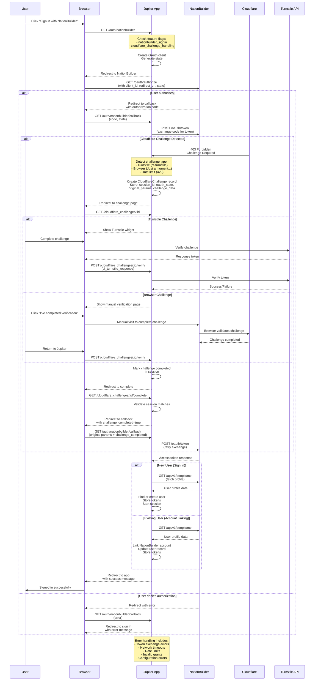

# NationBuilder OAuth with Cloudflare Challenge - Sequence Diagram

This document describes the complete OAuth authentication flow for NationBuilder integration, including Cloudflare challenge handling.

## Overview

The OAuth flow supports two primary use cases:
1. **New User Sign-in**: Users without Jupiter accounts can sign in using their NationBuilder credentials
2. **Account Linking**: Existing Jupiter users can link their NationBuilder accounts

The flow includes robust handling for Cloudflare challenges that may be encountered when communicating with NationBuilder's API.

## Sequence Diagram

## Flow Details

### 1. Initial Authorization Request

1. User clicks "Sign in with NationBuilder" button
2. Jupiter app checks feature flags:
   - `nationbuilder_signin`: Must be enabled globally
   - `cloudflare_challenge_handling`: Enables challenge handling capability
3. Creates OAuth2 client with configured credentials
4. Redirects user to NationBuilder's authorization endpoint

### 2. User Authorization

The user is presented with NationBuilder's authorization page where they can:
- **Approve**: Grants Jupiter access to their NationBuilder account
- **Deny**: Rejects the authorization request

### 3. Authorization Callback

After user action, NationBuilder redirects back to Jupiter with:
- **Success**: Authorization code and state parameter
- **Failure**: Error code and description

### 4. Token Exchange

Jupiter attempts to exchange the authorization code for access tokens by making a POST request to NationBuilder's token endpoint.

### 5. Cloudflare Challenge Handling

If Cloudflare protection is triggered during token exchange:

#### Challenge Detection
The service detects three types of challenges:
1. **Turnstile Challenge**: Interactive CAPTCHA-like widget
2. **Browser Challenge**: Manual verification required
3. **Rate Limit**: Too many requests (429 status)

#### Challenge Storage
Creates a `CloudflareChallenge` record containing:
- `challenge_id`: Unique identifier
- `session_id`: Links to user's session
- `oauth_state`: Original OAuth state parameter
- `original_params`: All callback parameters for flow resumption
- `challenge_data`: Type-specific challenge information
- `expires_at`: 15-minute expiration

#### Challenge Resolution

**For Turnstile Challenges:**
1. Display Cloudflare Turnstile widget
2. User completes the challenge
3. Widget returns a response token
4. Jupiter verifies token with Turnstile API
5. On success, marks challenge as completed

**For Browser Challenges:**
1. Display instructions for manual verification
2. User visits NationBuilder directly to complete challenge
3. User returns to Jupiter and confirms completion
4. Challenge marked as completed

### 6. Flow Resumption

After successful challenge completion:
1. Session validation ensures same user/session
2. Original OAuth callback is reconstructed with all parameters
3. Token exchange is retried (should succeed now)
4. Normal OAuth flow continues

### 7. User Account Handling

**New Users:**
1. Fetch profile from NationBuilder API
2. Create new Jupiter user account
3. Store OAuth tokens
4. Start authenticated session

**Existing Users (Account Linking):**
1. Fetch profile from NationBuilder API
2. Check for existing links to prevent duplicates
3. Update user record with NationBuilder UID
4. Store OAuth tokens
5. Maintain current session

### 8. Error Handling

The system handles various error scenarios:
- **Invalid Grant**: Authorization code expired or invalid
- **Redirect URI Mismatch**: Configuration error
- **Invalid Client**: Client credentials incorrect
- **Network Errors**: Timeouts and connection failures
- **Rate Limiting**: Too many requests
- **Challenge Expiration**: Challenge not completed in time

## Security Considerations

1. **State Parameter**: Prevents CSRF attacks by validating OAuth state
2. **Session Validation**: Ensures challenges are completed by the same session
3. **Token Encryption**: OAuth tokens are encrypted at rest using Rails encryption
4. **Challenge Expiration**: 15-minute timeout prevents stale challenges
5. **Feature Flags**: Granular control over feature availability

## Configuration Requirements

### Environment Variables
- `NATIONBUILDER_CLIENT_ID`: OAuth application ID
- `NATIONBUILDER_CLIENT_SECRET`: OAuth application secret
- `NATIONBUILDER_REDIRECT_URI`: Callback URL (must match NationBuilder config)
- `NATIONBUILDER_NATION_SLUG`: NationBuilder nation identifier
- `TURNSTILE_SITE_KEY`: Cloudflare Turnstile site key (for challenge widget)
- `TURNSTILE_SECRET_KEY`: Cloudflare Turnstile secret key (for verification)

### Feature Flags
- `nationbuilder_signin`: Enable/disable NationBuilder authentication
- `cloudflare_challenge_handling`: Enable/disable Cloudflare challenge support

## Related Files

- **Controllers:**
  - `app/controllers/nationbuilder_auth_controller.rb`: Main OAuth flow
  - `app/controllers/cloudflare_challenges_controller.rb`: Challenge handling
  
- **Services:**
  - `app/services/nationbuilder_token_exchange_service.rb`: Token exchange and challenge detection
  - `app/services/turnstile_verification_service.rb`: Turnstile token verification
  - `app/services/nationbuilder_user_service.rb`: User profile management
  
- **Models:**
  - `app/models/cloudflare_challenge.rb`: Challenge record storage
  - `app/models/nationbuilder_token.rb`: OAuth token storage
  
- **Components:**
  - `app/components/cloudflare_challenge_component.rb`: Challenge UI rendering